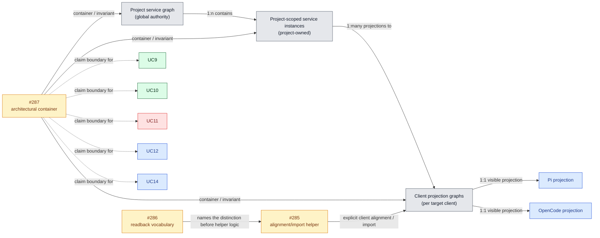
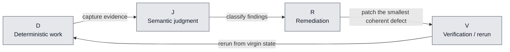

# ContextForge SuperLoop / Service Projection Review Pack

Review artifact only. This is not final architecture acceptance.

This pack explains the controller-owned SuperLoop queue, the currently modeled
UC1..UC15 ordinary-use-case project, the decomposed UC5 slice chain, the `#287`
project-service-graph vs per-client-projection model, and the `#286` / `#285`
/ `#287` claim boundary.

## Reading Key

- `accepted`: lower-layer behavior already documented in the repo and used as
  substrate.
- `current-remediation`: active work selected for remediation; not acceptance.
- `selected` or `pending`: modeled queue position, not acceptance.
- `candidate`: architectural or follow-on work still under review.
- `review-only`: this artifact explains the system; it does not certify it.
- `UC15` is the upper bound of the ordinary use-case set modeled by the current
  local docs, not a claim that no future `UCn` slices can exist.

## 1) Total Project Queue

The diagram below is intentionally split into bands so the full project can be
read left-to-right without turning into a single dense chain.

```mermaid
flowchart LR
  classDef accepted fill:#dcfce7,stroke:#166534,color:#052e16;
  classDef selected fill:#dbeafe,stroke:#1d4ed8,color:#1e3a8a;
  classDef remediation fill:#fee2e2,stroke:#dc2626,color:#7f1d1d;
  classDef candidate fill:#fef3c7,stroke:#d97706,color:#78350f;
  classDef review fill:#e5e7eb,stroke:#4b5563,color:#111827;

  SO["SuperLoop controller"]:::review
  Q["Ordered use-case queue"]:::review
  SO -->|owns / schedules| Q

  subgraph B0["Bootstrap and substrate"]
    UC1["UC1\nfresh project init"]:::accepted
    UC2["UC2\nresume initialized project"]:::accepted
    UC3["UC3\ncapability discovery"]:::accepted
    UC7["UC7\nstate / tool / readiness readback"]:::accepted
    UC4["UC4\ngovernance route"]:::accepted
  end

  subgraph B1["Service selection and negative choice"]
    UC5A["UC5a\n#270 taxonomy"]:::accepted
    UC5B["UC5b\n#259 readiness matrix"]:::accepted
    UC5C["UC5c..UC5k\n#260-#268 per-service slices"]:::accepted
    UC5L["UC5l\n#269 selection-shape validation"]:::accepted
    UC5U["UC5\numbrella service selection"]:::accepted
    UC6["UC6\ndecline / defer service"]:::accepted
  end

  subgraph B2["Cross-client and same-session operation"]
    UC9["UC9\nPi/OpenCode same project"]:::accepted
    UC10["UC10\nrefresh after project-state change"]:::accepted
    UC8["UC8\ntool use + follow-up"]:::accepted
    UC11["UC11\ncurrent remediation:\ntool guidance semantics"]:::remediation
  end

  subgraph B3["Projection, onboarding, readiness, handoff"]
    M286["#286\ncross-client disparity/readback vocabulary"]:::candidate
    M285["#285\nclient alignment / import helper"]:::candidate
    M287["#287\nproject-service-graph / projection container"]:::candidate
    UC12["UC12\nuncataloged MCP onboarding"]:::selected
    UC13["UC13\ncontrolled evidence surface"]:::selected
    UC14["UC14\ntrustworthy readiness report"]:::selected
    UC15["UC15\nhandoff and next actions"]:::selected
  end

  Q -->|1st| UC1
  UC1 -->|2nd| UC2
  UC2 -->|3rd| UC3
  UC3 -->|4th| UC7
  UC7 -->|5th| UC4
  UC4 -->|6th| UC5A
  UC5A -->|7th| UC5B
  UC5B -->|8th| UC5C
  UC5C -->|9th| UC5L
  UC5L -->|10th| UC5U
  UC5U -->|11th| UC6
  UC6 -->|12th| UC9
  UC9 -->|13th| UC10
  UC10 -->|14th| UC8
  UC8 -->|15th| UC11
  UC11 -->|16th| M286
  M286 -->|17th| M285
  M285 -->|18th| M287
  M287 -->|19th| UC12
  UC12 -->|20th| UC13
  UC13 -->|21st| UC14
  UC14 -->|22nd| UC15

  D["D\n deterministic harness work"]:::review
  J["J\n semantic judgment"]:::review
  R["R\n remediation"]:::review
  V["V\n verification / rerun"]:::review
  D -->|evidence| J -->|classify| R -->|repair| V -->|virgin rerun| D
  UC13 -.->|feeds evidence into| D
  UC14 -.->|requires scored evidence| J
```

### UC5 Decomposition

| Slice | Scope | State in this review pack |
| --- | --- | --- |
| `UC5a` | `#270` service localization taxonomy | accepted substrate |
| `UC5b` | `#259` helper-offered readiness matrix | accepted substrate |
| `UC5c` | `#260` Context7 single-service lifecycle | accepted substrate |
| `UC5d-UC5k` | `#261-#268` remaining per-service source lifecycle slices | accepted substrate |
| `UC5l` | `#269` single, curated multi-service, and all-services selection-shape validation | accepted substrate |
| `UC5` | umbrella service selection / apply / readback | accepted locally within install-only boundary |

### Status Notes

| Item | Label used | Local basis |
| --- | --- | --- |
| `UC8` | accepted | `docs/use-cases/use-case-8/controller-acceptance-20260620.md` records controller acceptance for Pi and OpenCode. |
| `UC9` | accepted | `docs/use-cases/use-case-9/controller-acceptance-20260620.md` records controller acceptance for the same-project consistency boundary. |
| `UC10` | accepted | `docs/use-cases/use-case-10/controller-acceptance-20260620.md` records controller acceptance for refresh/readback after project-state change. |
| `UC11` | current-remediation | `docs/use-cases/use-case-11/package.md` is materialized and selected after accepted UC8, but it says acceptance still requires fresh evidence, semantic evaluation, remediation as needed, and controller integration. Controller review reports semantic failure pending remediation. |

## 2) Project Service / Projection Model

## 3) Queue / Claim Boundary Table

| Item | May claim | Must not claim |
| --- | --- | --- |
| `UC9` | same project readback from Pi and OpenCode | automatic cross-client import or proof of projection alignment |
| `UC10` | refreshed state after a project-state change | that stale tools are still complete after the change |
| `UC11` | project-specific guidance for a selected capability | that project-global presence proves target-client import |
| `UC12` | structured onboarding for an uncataloged service | that a candidate service is already a trusted active projection |
| `UC14` | a readiness report with claim-layer honesty | that projection layers, visibility, reload state, and proof have collapsed into one fact |
| `#286` | readback vocabulary for disparity, visibility, reload, and proof | client alignment itself |
| `#285` | an explicit alignment / import helper | proof that every client already matches the project graph |
| `#287` | the architectural invariant and container | a dialogue use case or final acceptance result |

## 4) Controller Loop

## Self-Critique

This pack is useful if a reviewer needs to understand the queue, the
projection model, and the claim boundaries together. It does not try to
prove acceptance.

- Does each relation have a label?
- Does each band have a distinct purpose?
- Are `accepted`, `current-remediation`, `selected/pending`, and `candidate`
  visually separated?
- Does the project-service graph stay distinct from per-client projection?
- Does the queue order stay distinct from causal or acceptance claims?
- Would a table be clearer for any remaining ambiguity?

If any answer is no, the diagram should be revised before it is treated as a
review artifact.
